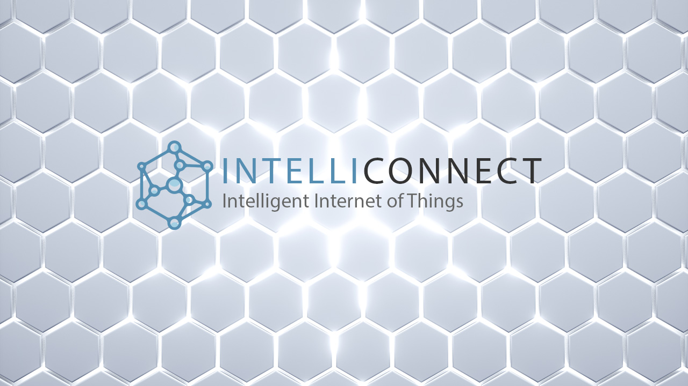

# IntelliConnect Examples

The IntelliConnect Examples provide starter kits that allow Innov8 Digital Media Tech customers to quickly prototype IntelliConnect assets and deploy them to their IntelliConnect network.

The current examples provide code and tutorials on how to set up:

- Raspberry Pi 4
    - [Temperature & Humidity](RPI4/Temperature-Humidity/README.md)
    - [Facial Recognition](RPI4/Facial-Recognition/README.md)

# More About IntelliConnect

IntelliConnect IoT is a new product by [Innov8 Digital Media Tech](https://tech.innov8digitalmedia.com/) that allows businesses to easily prototype, provision, deploy and scale intelligent IoT networks. For more information on IntelliConnect or to schedule a demo please [contact sales](https://tech.innov8digitalmedia.com/contact)