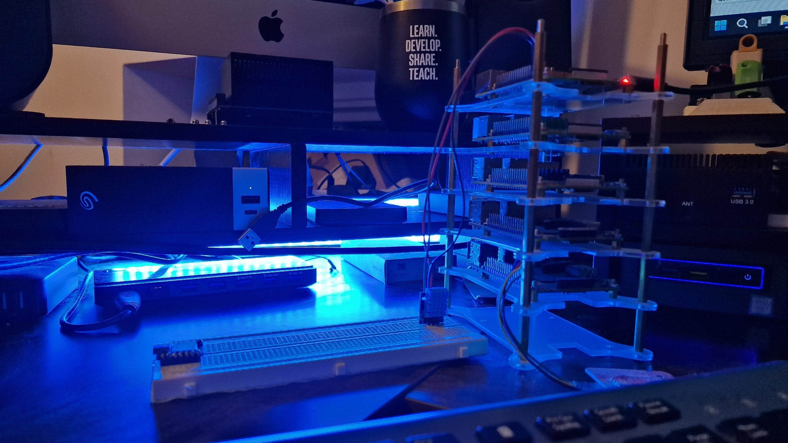
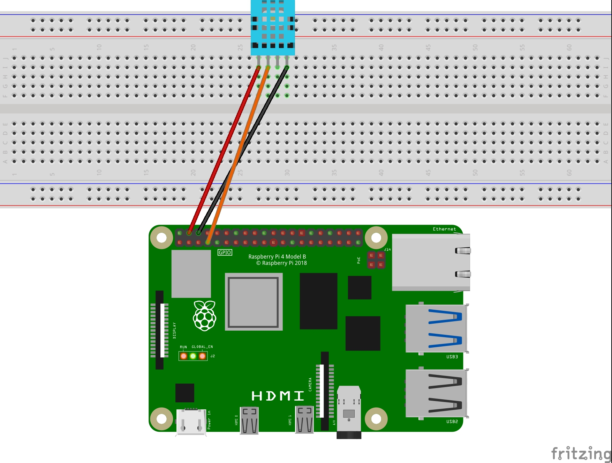
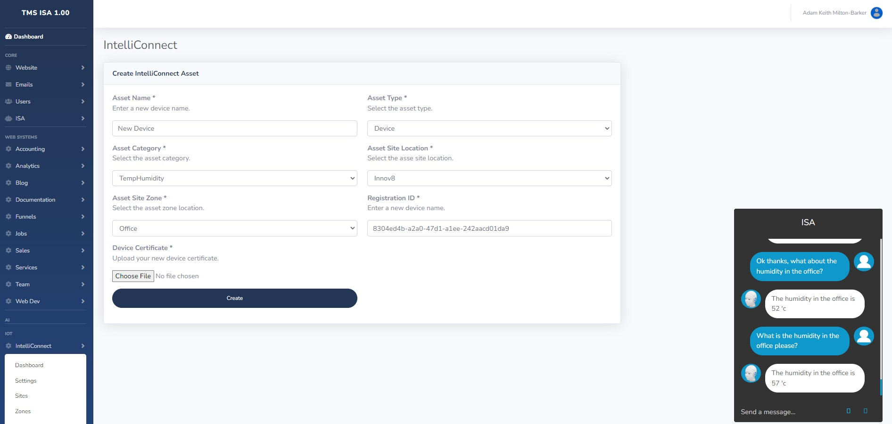
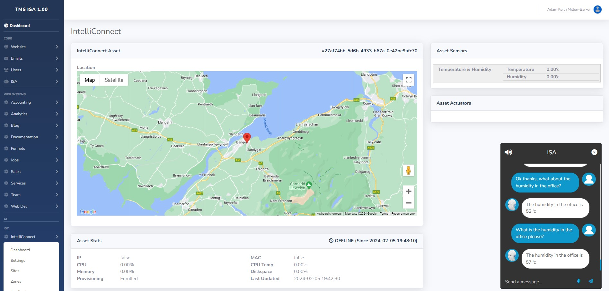
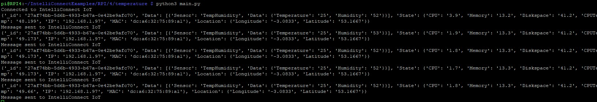
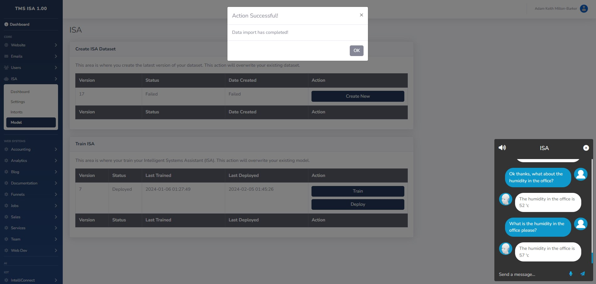
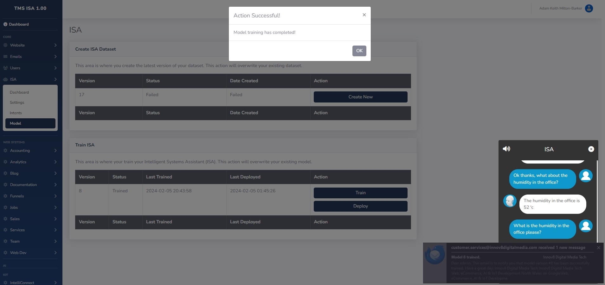
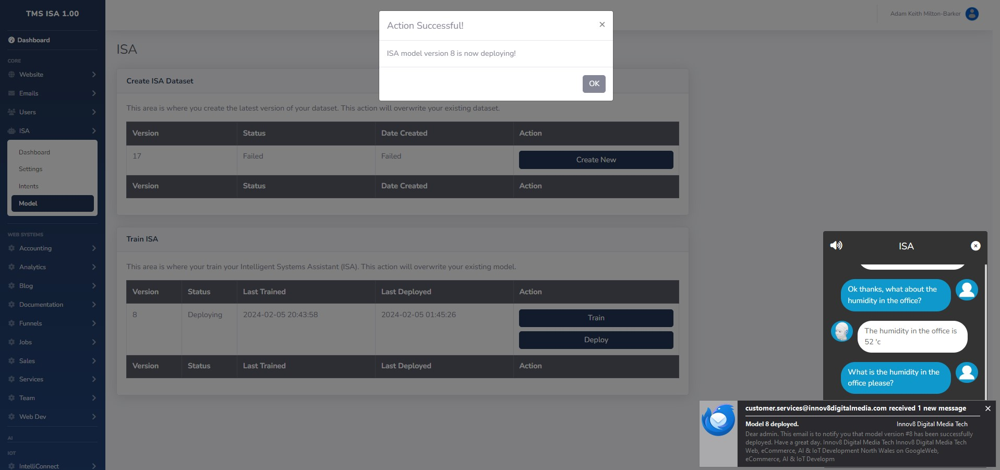
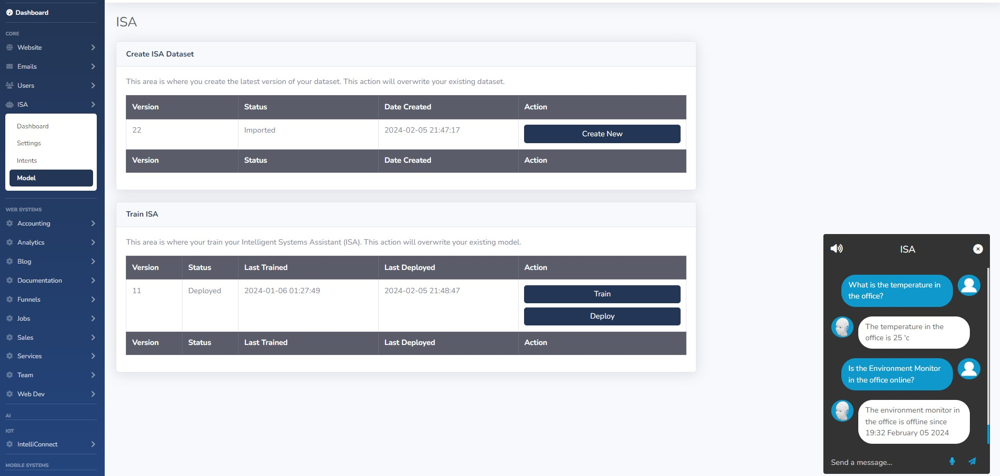

# IntelliConnect RPI 4 Temperature & Humidity Example



This IntelliConnect example takes you through creating a temperature and humidity device with the Raspberry Pi 4.

# Hardware Requirements

- [Raspberry Pi 4](https://thepihut.com/products/raspberry-pi-4-model-b) (Other models should work fine)
- [Breadboard](https://thepihut.com/products/full-sized-breadboard)
- [DH11 Temperature & Humidity Sensor](https://thepihut.com/products/dht11-temperature-humidity-sensor)
- [Wires](https://thepihut.com/products/thepihuts-jumper-bumper-pack-120pcs-dupont-wire)

# Hardware Setup



To set up your circuit follow the diagram above. Below you will find a pin map. Please note that depending on the version of your sensor these guides may be incorrect, please always check the correct pins of your DH11 sensor.

| RPI    | DH11 |
| -------- | ------- |
| GPIO 4  | Signal (Pin 2)    |
| 5V | Power (Pin 1)     |
| Ground    | Ground (Pin 4)    |

In the case your DH11 has 3 pins, use the following map:

| RPI    | DH11 |
| -------- | ------- |
| GPIO 4  | Signal (Pin 1)    |
| 5V | Power (Pin 2)     |
| Ground    | Ground (Pin 3)    |

# Software Setup

The following software assumes Windows.

- [GIT](https://git-scm.com/download/)
- [Azure CLI](https://aka.ms/installazurecliwindowsx64)

First install the software listed above. Next to install the program software, navigate to the directory where you would like set up the project and run:

```
git clone https://github.com/Innov8DigitalMediaTech/IntelliConnectExamples
cd IntelliConnectExamples/RPI4/Temperature-Humidity
sh install.sh
```

You will also need an API key from [IPInfo.io](https://ipinfo.io/).

# IntelliConnect Setup

In your business TMS head over to the IntelliConnect section and click on `Assets` then click on the `Actions` tab and select `Create Individual Asset`.



## Individual Device Enrollment

Enter or select the following:

- **Asset Name** - *Your new device name (Must be unique)*
- **Asset Type** - *Select Device*
- **Asset Category** - *Select TempHumidity*
- **Asset Site Location** - *Select the IntelliConnect Site this device will be installed in*
- **Asset Site Zone** - *Select the IntelliConnect Zone this device will be installed in*
- **Regsitration ID** - *You will need this value for your certificate*

### Device Security Certificate

Before you complete the device enrollment process you need to upload your device security certificate. There are two ways to do this, the first is by self-signing a certificate, and the second is by purchasing an X.509 CA certificate. Self-signed certificates are fine when testing in a non-public environment, but should absolutely not be used in production or public environments. If you are ready to deploy in production you should purchase an X.509 CA certificate that you can use to sign your asset certificates.

In both cases the common name (CN) needs to be set to the registration ID you are using to enroll your device.

#### Self Signed Certificate

**WARNING: This method should only be used for development environments and testing.**

##### Windows

To create a certificate on Windows you will need to have the required software listed above installed and then open a `GitBash` prompt.

Navigate to the directory you want to create the certificates in and run the following command, replacing `Your-Registration-ID` with the value found in the `Registration ID` field on the `Create IntelliConnect Asset` page. In the screen shot above you will see for this example the registration ID is `8304ed4b-a2a0-47d1-a1ee-242aacd01da9` however this will change for you each time you create a new device.

```
winpty openssl req -outform PEM -x509 -sha256 -newkey rsa:4096 -keyout device-key.pem -out device-cert.pem -days 30 -extensions usr_cert -addext extendedKeyUsage=clientAuth -subj "//CN=Your-Registration-ID"
```
You will be asked to enter a PEM password. In development and test environments you can use any value for you this but it is good to get into the habbit of using secure passwords so use a secure password here and make sure you keep it safe as you will need it later.

You should now have two files:

- `device-key.pem`
- `device-cert.pem`

You need to copy these files to to the certs directory in your project in the following location:

```
IntelliConnectExamples/RPI4/Temperature-Humidity/certs
```
### Complete The Enrollment

Now you can complete the enrollment of your new device. This step will create an enrollment for your device and once it starts running it will automatically be registered to the IntelliConnect network and begin publishing sensor data.

The system will also create training data for your Intelligent Systems Assistant (ISA) that will allow you to query the state of the device and its sensors.



To complete the enrollment, ensure you have filled out all of the information and uploaded your certificate and click `Create`. Once the process completes you will redirected to the asset page.

# Configure Your Device

In the `config/configs.json` file you will find the required configuration for your device.

```
{
    "host": "global.azure-devices-provisioning.net",
    "id_scope": "",
    "device_id": "",
    "registration_id": "",
    "ipinfo": "",
    "cert" : {
        "cert_file": "./certs/device-cert.pem",
        "key_file": "./certs/device-key.pem",
        "pass_phrase": ""
    }
}
```
Open this file in your editor and edit the following values:

- `id_scope` Your provisioning server ID Scope find on the related `Site` page in TMS.
- `device_id` Your device ID found at the top right of the map on the asset page in TMS.
- `registration_id` The registration ID you used to create the certificate and device.
- `ipinfo` Your IpInfo.io API key.
- `pass_phrase` The pass phrase you used to create your certificate.

Once you have made the above changes upload the file to the same location on your Raspberry Pi.

# Run Your Device

Now its time to run your device. Once you run the device the system will automatically register your device and connect it to the IntelliConnect platform, you will see the program print out `Connected to IntelliConnect IoT` before beginning to see the data that is being sent to IntelliConnect.



You will notice the `Provisioning` stat on the asset page will change from `Enrolled` to `Registered` and you will start to see real-time data coming in from your device.

# Training Your Intelligent Systems Assistant

Now you need to train your Intelligent Systems Assistant so that you can query the device in natural language using AI. When you created the device training data was automatically created.



Head over to the `ISA` control panel and head to `Model` then click on `Create New` in the `Create ISA Dataset` section. Once the new dataset has been generated you will be notified on screen and you will receive an email to your TMS contact email.



Next you need to train the ISA model. To do this click on the `Train` button and wait for it to complete. Once the new training has completed you will be notified on screen and you will receive an email to your TMS contact email.



Finally you need to deploy the new ISA model. To do this click on the `Deploy` button and wait for it to complete. Once the new deployment has completed you will be notified on screen and you will receive an email to your TMS contact email.



With your Intelligent Systems Assistant now aware of your new device, you can now query the status and values from the sensor by speaking to ISA. Examples of queries are:

- Is the `Device Name` in the `Zone` online? IE: **Is the environment monitor in the office online?**
- What is the `Measurement` in the `Zone`? IE: **What is the temperature in the office?**

